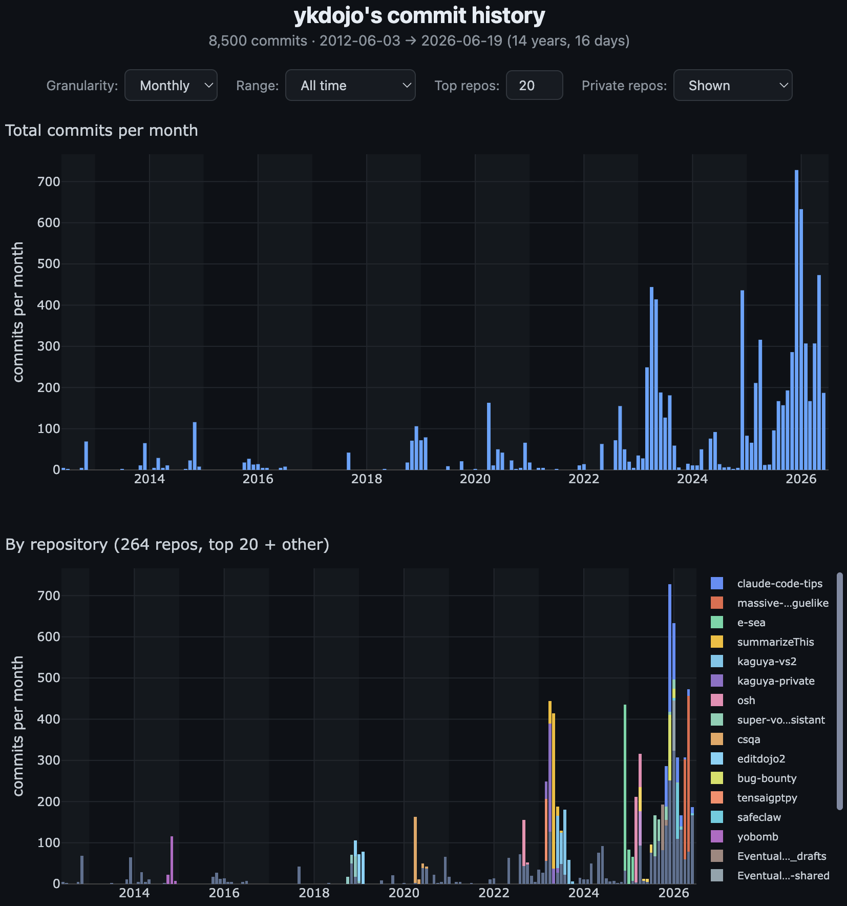
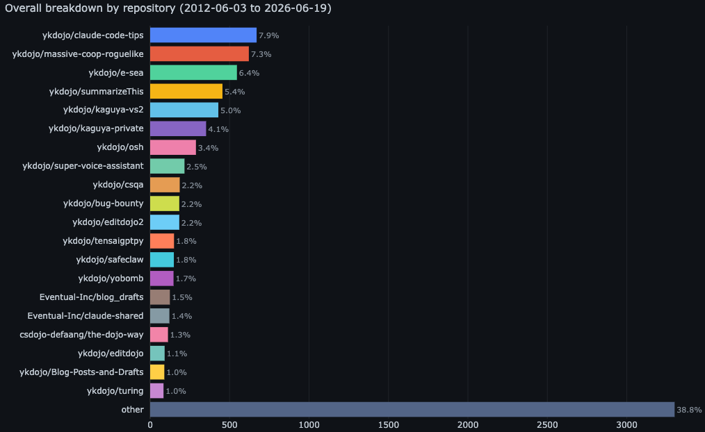

# gh-commit-history

[](https://www.npmjs.com/package/gh-commit-history)

Visualize your GitHub commit history across **all your years on one screen** as an interactive chart. Powered by the [GitHub CLI](https://cli.github.com/) - no API tokens needed.

GitHub's contribution calendar only shows one year at a time, daily-only, with no per-repo breakdown. This shows your whole history with switchable daily / weekly / monthly granularity, a flexible range selector, and a per-repository breakdown.

```
npx gh-commit-history ykdojo
```





Defaults to your authenticated user if no username is given.

## Prerequisites

- [Node.js](https://nodejs.org/) >= 16
- [GitHub CLI](https://cli.github.com/) installed and authenticated (`gh auth login`)

## Usage

```bash
npx gh-commit-history [username] [options]
```

### Options

| Flag | Description |
|------|-------------|
| `--years <n>` | Limit to the past n years (default: all history since account creation) |
| `--range <period>` | Initial view when the page opens: `1w`, `1m`, `3m`, `6m`, `1y`, `2y` … or `all` (default). Full history is still loaded - the range selector keeps every option. |
| `-g, --granularity <g>` | `daily`, `weekly` (default), or `monthly` |
| `--style <name>` | `blue` (default), `green`, or `purple` |
| `-o, --output <path>` | Output file path (default: `~/.gh-commit-history/<user>.html`) |
| `--exclude-private` | Exclude private repositories (private are included by default) |
| `-r, --repo <name>` | Single-repo view: just this repo's commits, timeline scoped to its lifetime (`name` assumes your account, or pass `owner/name`) |
| `--no-open` | Don't auto-open the browser |
| `--no-cache` | Skip cache and fetch fresh data |
| `-h, --help` | Show help |

### Examples

```bash
# Your whole history, weekly
npx gh-commit-history

# Someone else, monthly
npx gh-commit-history ykdojo -g monthly

# Last 5 years, green accent
npx gh-commit-history torvalds --years 5 --style green

# A single repository's progress (timeline scoped to that repo's lifetime)
npx gh-commit-history --repo strategy-deckbuilder

# Open straight to the past month, daily
npx gh-commit-history --range 1m
```
